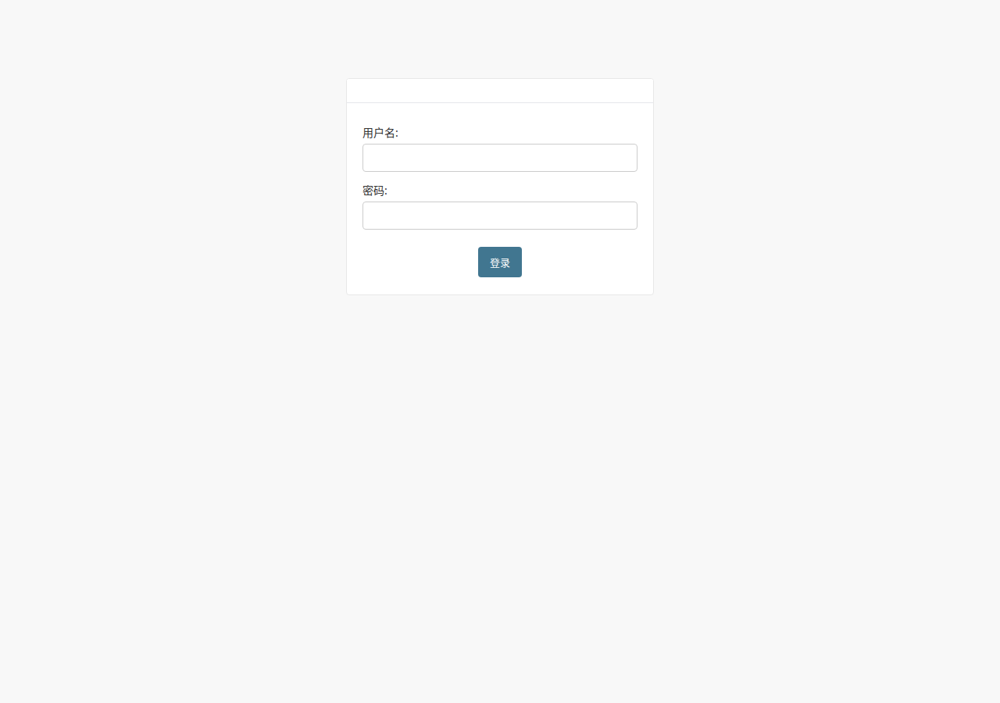

# 金桥融通WMS系统管理员操作手册

**文档版本：** V2.0

**适用系统版本：** 2026-08-04 当前工作区业务基线

**适用对象：** 系统管理员

**正式权限组：** `超级管理员或经过审批的后台管理权限组`

**主要入口：** Web 控制台 / Django Admin

**文档状态：** 交付版

> 本手册按当前业务代码、权限校验、客户端页面和自动化测试契约编写。实际菜单由角色、权限和显式数据范围共同决定。

## 使用范围

| 项目 | 本角色要求 |
|---|---|
| 角色 | 系统管理员 |
| 正式权限组 | `超级管理员或经过审批的后台管理权限组` |
| 主要入口 | Web 控制台 / Django Admin |
| 数据范围 | 超级管理员为全局范围；普通后台账号仍受显式角色范围和权限限制 |

本册可独立用于培训和日常操作，不要求先阅读合订版。涉及其他岗位时，只说明交接点，不授权本角色代替其他岗位操作。

## 登录、账号与通用安全

### 首次登录

1. 从系统管理员处取得正式入口、用户名和初始密码。
2. 打开本岗位对应的应用或 Web 地址，输入用户名和密码。
3. 登录后核对显示姓名、业务角色以及货主或仓库范围。
4. 首次登录立即进入“我的 → 修改密码”或 Web 右上角密码修改入口。
5. 如果能够登录但没有菜单，不要借用其他账号，记录用户名、入口和页面截图并联系系统管理员。

### 账号和数据范围

- 一人一号，不得共用账号或把密码留在 PDA、电脑旁。
- 角色决定能够执行什么操作；显式角色范围决定能够操作哪个货主或仓库的数据。
- 普通 WMS 用户只能启用一种业务角色。除仓库老板可授权多个仓库外，其他角色只能有一个活动范围。
- 超级管理员使用全局权限，不设置业务角色范围；超级管理员账号不得用于日常开单、审批和现场作业。
- 离职、调岗、合作终止或设备丢失后，应立即停用账号并保留审计记录。

### 通用操作原则

1. 操作前核对货主、仓库、客户、商品、批次、库位和单据号。
2. 扫码后必须核对系统命中的商品名称和规格，不能只凭提示音继续。
3. 审核、复核、过账、取消和库存调整会改变业务状态或库存，提交前必须再次确认。
4. 系统提示成功后再离开页面；网络中断时先查询原单状态，确认未成功后才重试。
5. 禁止通过直接修改库存明细来代替正常收货、上架、拣货、复核、盘点或调整流程。
6. 页面入口可见不代表账号一定有执行权限；最终以服务器返回的角色、权限和数据范围校验为准。

### 修改密码与退出

1. 修改密码时输入原密码、新密码和确认密码；新密码必须通过系统安全校验。
2. 修改成功后退出，并用新密码重新登录验证。
3. 当班结束或共用设备交接前必须从“我的”或用户菜单执行退出，不能只关闭屏幕或浏览器。

---

## 角色定位与权限边界

系统管理员是后台管理职责，不是 `UserRoleScope` 中的业务角色。超级管理员通过 Django `is_superuser` 获得全局访问；其他后台账号仍必须通过职员状态、显式业务角色范围、规范角色组和经过审批的辅助权限组合授权。

系统管理员负责账号、角色范围、基础资料、配置和审计，不代替业务员开单、货主管理员审核、仓库管理员确认或操作员现场作业。

## 用户和角色范围管理

### 新建用户

1. 进入“系统 → 用户”新增账号，设置唯一用户名、姓名、联系方式和初始密码。
2. 设置账号为有效；只有需要登录 Web 后台的账号才启用职员状态。
3. 普通业务用户不要勾选超级用户。
4. 在“用户角色范围”新增一条活动范围，选择业务角色及对应货主或仓库。
5. 保存后系统自动同步对应规范角色组，检查“系统规范角色组”显示是否正确。
6. 使用该角色测试账号验证入口、菜单、允许操作和数据隔离，再安全交付初始密码。

### 范围规则

- 仓库操作员、仓库管理员只能配置一个活动仓库范围。
- 货主业务员、货主管理员只能配置一个活动货主范围。
- 仓库老板可以为同一角色配置多个活动仓库范围。
- 同一普通用户不能同时启用多个业务角色。
- 超级管理员使用全局范围，不得再配置业务角色范围。
- 用户模型中的旧 `owner`、`warehouse` 字段仅供 POS、商城等兼容模块使用，不决定 WMS 角色和数据范围。

## 规范角色组与“仓库主管”说明

系统规范角色组包括：

- `WMS::仓库操作员`
- `WMS::仓库管理员`
- `WMS::仓库老板`
- `WMS::货主管理员`
- `WMS::货主业务员`

规范角色组名称固定，由角色范围自动同步，不应手工改名或删除。需要调整规范权限模板时应通过代码、迁移和测试发布，不能在生产环境临时修改后不留记录。

“仓库主管”是旧兼容组名，当前会识别为仓库老板角色。企业内部的作业主管若要确认单据、管理任务，应配置 `WMS::仓库管理员`，不能创建或沿用名为“仓库主管”的组。

## 额外权限管理

- 商品 Excel 导入、POS、计费、报表导出、商城运营等不一定属于规范角色默认权限，应使用经过审批的辅助权限组。
- 优先使用权限组，不给个人账号长期追加零散权限。
- 删除、直接库存调整、计费规则、退款、支付状态、批量导入和用户授权属于高风险权限。
- 每次权限变化后检查审计事件，并使用边界数据验证不能访问其他货主或仓库。
- 不得用额外权限绕过显式角色范围；权限授予能力，角色范围限制能够触达的数据。

## 基础资料维护顺序

建议按以下顺序建档：

1. 货主。
2. 仓库、子仓、库位及货主—仓库授权关系。
3. 商品分类、品牌、商品、基本单位、辅助单位和包装换算。
4. 客户、供应商、承运商、司机和车辆。
5. 入库、出库、分配、拣货和效期策略。
6. 计费规则、阶梯和账期。
7. 用户、显式角色范围及必要的辅助权限。

货主商品编码、仓库SKU编码、标准贸易条码和其他条码应唯一稳定；标准贸易条码是 `gtin` 字段，对应 GTIN/EAN/UPC。基本单位是库存记账单位。修改包装换算、批次/效期控制或停用商品前，必须确认没有未完成单据、任务和库存影响。

## Excel 导入与批量配置

- 使用系统当前页面下载的模板，不复用历史模板。
- 商品导入按权限和数据范围校验，整批原子处理；任意错误会阻止整批写入。
- 公式、重复标识、其他货主数据、无效扩展名和超限文件会被拒绝。
- 仓库SKU编码由系统规则生成时，用户模板中的仓库SKU编码不作为覆盖依据。
- 无订单批量入库、一件代发导入与商品主数据导入用途不同，禁止混用模板。
- 导入后保存结果、审计记录和抽查样本，不能只依据前端提示判断成功。

## 商城、POS 与计费管理边界

- POS 权限、打印配置、撤销和退款按专项 POS 手册管理；POS 销售通过统一任务和过账链路影响库存。
- 商城上架、支付、退款、评价审核和批量配置按商城专项指南管理；商城买家不配置 WMS 业务角色。
- 计费规则、账期锁定、开票和解锁属于高风险财务操作，应保留审批依据和审计记录。
- 系统管理员可以维护配置和排查异常，但不能代替货主或仓库确认业务事实。

## 审计、账号安全与故障处理

1. 在审计事件和 Admin 日志中按用户名、时间、模块和操作类型查询。
2. 发现异常新增、修改、删除、导入、导出或授权时，先停用可疑账号并保留日志。
3. 遗忘密码走重置流程；管理员不得读取、传播或在群聊中发送明文密码。
4. 角色范围冲突、缺失规范组或范围与组不一致时，账号应保持拒绝访问，修正配置后再验证。
5. 库存、订单、支付和账单异常应先保全事实记录，不直接改数据库或删除流水。

服务器部署、数据库备份恢复、域名证书、服务启停和版本回滚属于独立运维流程，本手册不授权在生产服务器直接操作。

## 用户开通验收表

- [ ] 用户名唯一，姓名和联系方式正确。
- [ ] 账号有效，职员/超级用户状态符合用途。
- [ ] 只有一种业务角色，货主或仓库范围正确。
- [ ] 规范角色组已自动同步，没有无关高权限组。
- [ ] 老板多仓范围逐仓验证，其他角色没有多活动范围。
- [ ] 登录入口、菜单和岗位一致。
- [ ] 不能查看其他货主或仓库数据。
- [ ] 高风险按钮只对授权人员可见且服务端会再次校验。
- [ ] 初始密码已安全交付并要求首次修改。

## 常见状态与控制点

| 状态 | 含义 | 操作要求 |
|---|---|---|
| 草稿 / DRAFT | 单据尚未正式提交 | 原创建人可在权限允许时修改、提交或删除未生效内容 |
| 待货主审核 / OWNER_PENDING | 业务员已经提交 | 等待货主管理员通过、退回或取消 |
| 货主已通过 / OWNER_APPROVED | 商业条件已确认，库存可能已冻结 | 等待仓库管理员确认并发布任务 |
| 待仓库确认 / WHS_PENDING | 等待仓库接单 | 仓库管理员检查仓库、库存和履约条件 |
| 仓库已确认 / WHS_APPROVED | 已进入仓库履约 | 不得随意修改原订单 |
| 保留 / RESERVED | 任务已因货主审核创建但尚未发布 | 仓库确认前不得现场执行 |
| 待发布 / READY | 任务具备发布条件 | 由仓库管理员发布 |
| 已发布 / RELEASED | 操作员可以领取或执行 | 按任务逐行扫描作业 |
| 执行中 / IN_PROGRESS | 已发生现场作业记录 | 继续完成剩余任务行，不得另建重复任务 |
| 已完成 / COMPLETED | 作业数量已经完成 | 等待复核、审核或过账 |
| 待审核 / PENDING | 需要复核或管理确认 | 核对实物、数量、批次和库位 |
| 已过账 / POSTED | 库存影响已正式生效 | 错误只能通过规范冲销或批准的调整处理 |
| 过账失败 / FAILED | 库存写入没有成功完成 | 保留原任务号和错误信息，交管理员处理 |
| 已驳回 / REJECTED | 审核未通过 | 查看原因并按流程修改、重提或终止 |
| 已取消 / CANCELLED | 单据或任务终止 | 核对冻结库存是否释放、现场实物是否隔离 |

关键控制点：

- 货主管理员审核是商业确认，仓库管理员确认是履约确认，两者不能互相替代。
- 标准出库必须先完成货主审核，再由仓库管理员确认发布；系统已停用仓库端代替货主审批的一键流程。
- 拣货完成不等于库存已经扣减；以任务过账状态 `POSTED` 和库存流水为准。
- 取消、撤回或驳回涉及已冻结库存时，必须核对分配量已经释放；任务已开始或已有执行数量时，系统会阻止直接取消。

---

## 异常处理与问题上报

### 无法登录或菜单缺失

按“网络 → 入口 → 用户名和密码 → 账号启用状态 → 职员状态 → 角色范围 → 规范角色组 → 额外权限”的顺序检查。连续失败后停止尝试，由系统管理员查看账号和审计日志。

### 数据为空或范围不正确

先清除筛选并刷新，再核对当前角色和货主/仓库范围。看到不属于本范围的数据时立即停止操作并上报，不得导出或转发。

### 网络超时或重复提交提示

不要连续点击。先回到列表按单号、任务号或平台单号查询；带幂等保护的操作可以使用同一请求重试，但不能改动内容后继续使用原请求标识。

### 库存、任务或账单不一致

保留页面截图和原始单号，按“业务单据 → 任务 → 扫描记录 → 过账状态 → 库存流水/计费来源”逐层核对。禁止通过删除记录或直接改汇总数掩盖差异。

### 问题上报模板

- 上报人、角色、用户名：
- 发生时间和系统入口：
- 货主、仓库、客户：
- 订单号、任务号、平台单号或账期：
- 货主商品编码、批次、库位和数量：
- 当前状态、期望结果和实际结果：
- 完整错误提示：
- 是否发生实物移动、收付款或打印：
- 已执行的查询和重试：
- 截图或导出文件：

## 日常自检与培训验收

- [ ] 能使用本人账号登录、修改密码并正确退出。
- [ ] 能说明本角色的数据范围和禁止事项。
- [ ] 能完成本手册列出的核心业务流程。
- [ ] 能识别会改变库存或业务状态的高风险按钮。
- [ ] 遇到网络中断时会先查询原单，不重复建单。
- [ ] 能使用问题模板提交可追踪的异常信息。

## 专项手册与边界

- POS 收银、退款、交班和 POS 对账参见 `docs/pos_user_manual.md`；只有取得相应 POS 权限的账号才能使用。
- 面向终端客户的商城参见 `docs/sales-miniapp-user-guide.md`；商城买家不是本手册六类 WMS 后台角色。
- 服务器部署、数据库备份恢复、域名证书、服务启停和版本回滚不属于普通用户手册。
- 没有已注册页面、有效权限和可验证业务闭环的功能，不作为正式可用能力发布。

## 文档修订记录

| 版本 | 日期 | 说明 |
|---|---|---|
| V2.0 | 2026-08-04 | 按当前代码、权限和客户端契约拆分角色手册并修订业务流程 |
