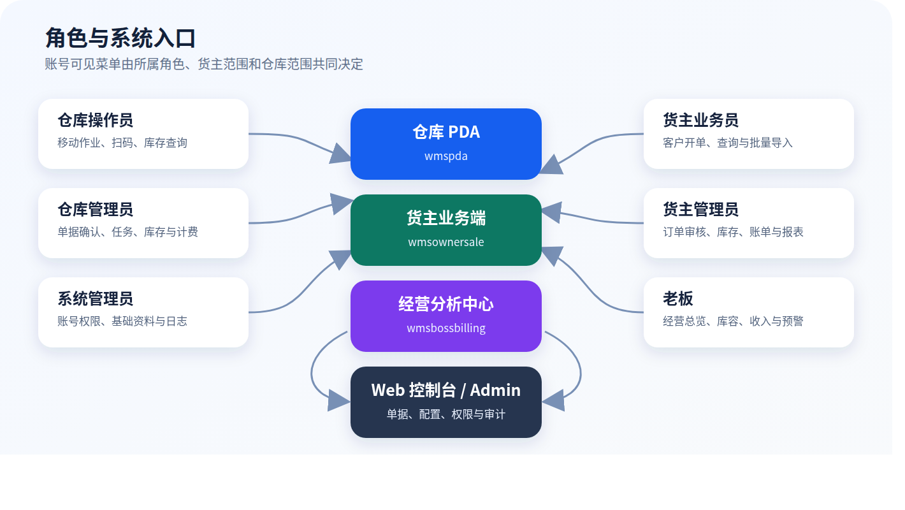

# 金桥融通仓库管理系统（WMS）操作手册

**文档版本：** V1.0  
**适用系统版本：** 2026 年 7 月交付基线  
**适用对象：** 仓库操作员、仓库管理员、货主管理员、货主业务员、系统管理员、老板  
**文档状态：** 交付版  
**编制日期：** 2026 年 7 月 16 日

> 本手册用于系统上线培训、日常操作和问题排查。文中菜单以账号实际权限为准；若页面、按钮或数据范围与手册不一致，不要借用他人账号操作，应联系系统管理员核对角色、所属货主和所属仓库。

---

## 1. 手册说明

### 1.1 系统组成

金桥融通 WMS 由四个作业入口组成：

- **仓库 PDA（wmspda）**：仓库现场移动作业，当前交付范围包括无订单收货、代货主出库、拣货、复核/过账、库存查询和仓库统计。
- **货主业务端（wmsownersale）**：货主侧开单、订单审核、一件代发导入、实时库存、报表和账单查询。
- **仓储经营分析中心（wmsbossbilling）**：面向老板的只读经营看板，覆盖作业节奏、库存与库容、收入与计费、预警中心。
- **Web 控制台 / Django Admin**：面向仓库管理员和系统管理员的单据确认、任务管理、库存管理、计费配置、基础资料、用户权限和日志查询。

### 1.2 本手册范围

本册只描述当前交付基线中能够形成操作闭环的仓储功能。以下内容不在本册范围内：

- POS 收银、退款、交班和 POS 对账，参见独立的《POS 用户操作手册》。
- 面向终端消费者的商城小程序，参见独立的《销售小程序用户指南》。
- 服务器部署、数据库备份恢复、域名证书、服务启停和版本回滚。
- PDA 工作台上尚未形成已验收页面的有订单收货、上架、打包、发运、补货、移库和盘点入口。

### 1.3 操作原则

1. 一人一号，禁止共用账号或把密码写在 PDA/电脑旁。
2. 操作前确认页面顶部的货主、仓库、客户和单据号；跨货主、跨仓数据不得代为修改。
3. 数量、批次、生产日期、有效期和库位是库存追溯依据，提交前必须逐项核对。
4. 审核、复核、过账和取消会改变库存或业务状态，遇到不确定情况先停止，不得反复点击。
5. 系统提示成功后再离开页面；网络中断时先查询原单状态，确认未成功后才允许重试。
6. 禁止直接修改库存明细来代替正常收货、拣货、盘点或调整流程。

---

## 2. 角色职责与权限速查

| 角色 | 主要入口 | 主要职责 | 可见数据范围 | 禁止事项 |
|---|---|---|---|---|
| 仓库操作员 | 仓库 PDA | 收货、代货主出库、拣货、复核/过账、库存与报表查询 | 绑定仓库；代办功能还受货主授权限制 | 不维护基础资料，不擅自调整库存，不越权审核货主订单 |
| 仓库管理员 | Web 控制台 / Admin，必要时 PDA | 入出库确认、任务发布与监督、库存处理、计费与报表核查 | 绑定仓库及其业务数据 | 不绕过审核链，不直接删除已产生库存影响的单据 |
| 货主业务员 | 货主业务端 | 客户开单、选品、订单提交、一件代发导入、订单查询 | 绑定货主 | 不执行货主管理员审核，不查看其他货主数据 |
| 货主管理员 | 货主业务端 | 出库审核、退回、取消，库存、报表和账单核对 | 绑定货主 | 不替仓库完成实物作业或仓库确认 |
| 系统管理员 | Web 控制台 / Admin | 账号、角色、权限、货主/仓库范围、基础资料和日志 | 按管理权限 | 不代替业务岗位开单、审核、拣货或过账 |
| 老板 | 仓储经营分析中心 | 查看经营总览、库容、收入、计费和预警 | 绑定仓库；可按授权筛选货主 | 经营端为只读，不在此端改业务数据 |

### 2.1 账号范围的含义

- **所属货主**：限制货主业务员、货主管理员只能访问本货主的客户、商品、订单、库存和账单。
- **所属仓库**：限制仓库人员和老板只能访问当前仓库业务；老板可在仓库范围内切换货主查看。
- **角色/用户组**：决定菜单和按钮。仅绑定货主或仓库但未分配角色时，可能可以登录但看不到功能。
- **启用状态**：停用账号不能登录；离职、调岗或货主合作终止后应立即停用。

---

## 3. 登录、退出与通用操作

### 3.1 首次登录

1. 从系统管理员处取得正式入口、用户名和初始密码。
2. 打开对应应用或 Web 地址，输入用户名和密码，点击“登录”。
3. 首次进入后检查显示姓名、所属货主或所属仓库是否正确。
4. 进入“我的 → 修改密码”，使用原密码设置个人新密码。
5. 若登录后菜单为空，记录用户名和页面截图，联系系统管理员核对权限。

> **截图位：货主业务端登录界面。** 待在正式交付 APK/H5 环境中补充，界面操作为“用户名 → 密码 → 登录”。

### 3.2 修改密码

1. 进入“我的 → 修改密码”或 Web 端右上角的密码修改入口。
2. 输入原密码、新密码和确认密码。
3. 新密码必须满足系统安全规则，两次新密码必须一致。
4. 提示“密码修改成功”后，退出并使用新密码重新登录。

### 3.3 正确退出

完成当班操作后，从“我的”或页面“退出”按钮退出。共用设备交接班时必须退出账号，不得只关闭屏幕。

### 3.4 搜索、筛选和刷新

- 搜索商品可使用名称、编码、SKU 或条码；搜索客户、货主、供应商可使用名称或编码。
- 先缩小货主、仓库、状态、日期范围，再搜索单号或名称，结果更准确。
- PDA 扫码后应核对系统命中的商品名称和规格，不能只凭提示音继续操作。
- 列表数据异常时先下拉刷新或点击“刷新”，不要立即重复提交。

### 3.5 常见状态说明

| 状态 | 含义 | 操作要求 |
|---|---|---|
| 草稿 / DRAFT | 单据尚未提交 | 业务员可继续修改或删除未生效明细 |
| 待货主管理员审核 / OWNER_PENDING | 业务员已提交 | 货主管理员审核通过、退回修改或取消 |
| 货主已通过 / OWNER_APPROVED | 货主确认业务有效 | 等待仓库确认和生成/发布作业任务 |
| 待仓库确认 / WHS_PENDING | 等待仓库接单 | 仓库管理员核对库存、仓库和业务条件 |
| 仓库已确认 / WHS_APPROVED | 已进入仓库履约 | 操作员按任务执行，不能随意改订单 |
| 已发布 / RELEASED | 任务可领取或执行 | 操作员开始扫描作业 |
| 执行中 / IN_PROGRESS | 已发生作业记录 | 继续完成剩余任务行 |
| 已完成 / COMPLETED | 作业数量完成 | 等待复核或过账，不能再随意改数量 |
| 待复核 / PENDING | 需要第二次核对 | 复核人核对商品、数量、批次和库位 |
| 已过账 / POSTED | 库存影响已正式生效 | 只能通过规范冲销/调整处理错误 |
| 已驳回 / REJECTED | 审核未通过 | 查看原因，修改后重新提交或关闭 |
| 已取消 / CANCELLED | 单据或任务终止 | 检查已冻结库存是否正确释放 |

---

## 4. 跨角色标准业务流程

### 4.1 出库订单到库存扣减

| 步骤 | 责任角色 | 系统操作 | 完成标志 |
|---|---|---|---|
| 1 | 货主业务员 | 选择客户、选品、录入数量/价格和收件信息，提交订单 | 订单进入待货主管理员审核 |
| 2 | 货主管理员 | 核对客户、商品、数量、价格和地址，通过或退回 | 通过后进入仓库确认阶段 |
| 3 | 仓库管理员 | 核对仓库、库存和订单，确认并发布拣货任务 | 拣货任务可在 PDA 中看到 |
| 4 | 仓库操作员 | 进入拣货任务，扫码/录入数量，完成拣货 | 任务完成并进入待复核 |
| 5 | 复核人员 | 核对商品、数量和库位，点击“复核通过” | 任务复核通过并库存过账 |
| 6 | 仓库管理员 | 查询订单、任务和库存流水 | 任务 POSTED，现存量减少，冻结量释放 |

**关键控制点：**

- 货主审核是商业确认，仓库确认是履约确认，不能相互替代。
- 出库订单审核后会冻结/分配库存；取消或驳回后必须核对冻结量是否释放。
- 拣货完成不等于库存已扣减，以“已过账 / POSTED”为准。

### 4.2 无订单收货到库存增加

| 步骤 | 责任角色 | 系统操作 | 完成标志 |
|---|---|---|---|
| 1 | 仓库操作员 | PDA 选择货主和供应商 | 页面顶部显示正确货主 |
| 2 | 仓库操作员 | 搜索/扫描商品，录入单位、数量、批次和日期 | 待收货明细数量正确 |
| 3 | 仓库操作员 | 进入入库单清单复核并提交 | 系统返回收货任务号 |
| 4 | 仓库管理员 | 查询任务、库存明细和库存汇总 | 库存增加且有任务/过账记录可追溯 |

**关键控制点：** 同一商品不同批次或不同效期必须分行录入；批次号建议统一使用大写；数量必须大于 0。

### 4.3 月度账单核对

1. 仓库管理员确认计费规则、账期和计费数据已生成。
2. 货主管理员在“计费总览”选择账期，核对按收费类型汇总、状态汇总和每日趋势。
3. 进入账单详情，核对账单期间、费用行、不含税金额、税额和价税合计。
4. 老板在“收入与计费”按货主、日期、收费类型和状态查看整体收入。
5. 发现差异时记录货主、仓库、账期、收费类型和对应业务单号，由仓库管理员追溯计费事件；不得直接改账单总额掩盖差异。

---

## 5. 仓库操作员操作指南

### 5.1 登录与班前检查

1. 使用本人仓库操作员账号登录仓库 PDA。
2. 确认首页能看到当前授权功能；“代货主出库”只有同时具备仓库操作权、代办权限且货主已授权时才显示。
3. 进入“我的”核对用户名，确认设备网络正常、扫描头可用、电量充足。
4. 进入库存或报表页面执行一次刷新，确认能够读取当前仓库数据。

### 5.2 无订单收货

适用场景：实物已到仓但系统中没有可关联的入库订单，且现场已取得货主授权。

1. 首页点击“收货（无订单）”。
2. 在“选择货主”页面输入货主名称/编码或扫码，点击“搜索”，选中正确货主。
3. 点击“下一步：记录供应商”，搜索并选择供应商。
4. 进入商品录入页，输入商品名称、编码或条码，或点击“扫码”。
5. 核对商品名称、规格、条码和基本单位。
6. 选择收货单位，确认系统显示的换算数量；录入收货数量。
7. 按商品追溯要求填写批次、生产日期和有效截止日期。日期格式为 `YYYY-MM-DD`。
8. 点击“添加”将本次数量累加到已有同批次行；需要把原数量直接改成当前输入值时点击“改为”。
9. 点击底部“查看、提交入库单”，逐行核对商品、基本数量、基本单位、批次和日期。
10. 删除错误行或返回继续录入；确认全部数量大于 0 后点击“提交订单”。
11. 记录系统返回的收货任务号；如系统打开打印/导出页面，按现场要求打印或保存。
12. 返回库存查询，用同一货主、商品和仓库核对库存是否增加。

**不得提交的情况：** 货主不明、商品无法唯一匹配、包装换算不清楚、批次/效期应填但现场无法提供、实物数量尚未复点。

### 5.3 代货主出库

适用场景：货主已在系统中启用“允许仓库代办出库”，并授权当前仓库操作员代为创建和完成出库。

1. 首页点击“代货主出库”。若入口不可见，点击页面的“重新读取权限”；仍不可见时联系管理员。
2. 搜索并选择货主，核对授权提示。
3. 搜索并选择客户；更换货主会清空已选客户和商品，应重新选择。
4. 搜索商品名称、SKU 或条码，核对价格后点击“添加”。无有效价格的商品不能加入。
5. 在“出库明细”录入每行数量，数量必须大于 0。
6. 按实际业务填写源单号、收件人、联系电话、收货地址、订单备注和代办原因。CASH 客户必须填写收件人、电话和地址。
7. 复核货主、客户、商品、数量、价格和地址后提交。
8. 系统提示“代办订单已创建”后记录订单号，进入拣货任务执行。
9. 网络中断或页面提示重试时，先查询订单；系统可能提示“已恢复原代办订单”，这表示原请求已成功，不要重复建单。

### 5.4 拣货任务

1. 首页点击“拣货”，在任务列表中选择当前仓库的活动任务。
2. 进入任务详情，核对任务号、货主、状态、复核状态和过账状态。
3. 按系统任务行到指定库位取货，核对商品、批次/效期和计划数量。
4. 扫描商品条码或手工输入条码，填写本次数量，点击“提交扫码”。
5. 观察已完成数量是否增加；如需修正，使用页面允许的数量调整功能，并再次核对实物。
6. 所有任务行完成后点击“完成拣货”。若提示仍有未拣完行，返回逐行检查。
7. 系统创建复核任务后，按现场岗位分工交给复核人员。

**扫码异常处理：**

- 提示商品不匹配：停止拣货，核对库位、商品条码和任务行。
- 数量超过计划：复点已拣数量，纠正后再提交。
- 找不到库存：不要换货主、批次或库位凑数，通知仓库管理员处理差异。
- 重复扫码：以页面累计数量为准，必要时在提交完成前调整。

### 5.5 复核并过账

**双人复核：**

1. 复核人员进入“复核”，打开待复核任务。
2. 核对任务号、货主和每行商品、计划数量、完成数量、批次及库位。
3. 发现数量异常时先复点实物；不可用“复核通过”跳过差异。
4. 全部一致后点击“复核通过”。
5. 系统提示复核通过并已过账后，确认任务过账状态为 `POSTED`。

**单人复核并出库：** 仅在系统明确显示允许自复核时使用。点击“复核并确认出库”后，系统会再次提示风险；操作员必须重新核对商品、数量和库位，再点击“确认出库”。

### 5.6 库存与仓库统计查询

- “查询/公司库存汇总”可按仓库、货主和商品查看在库、可用、已分配、锁定和损坏数量。
- “报表/仓库统计”可选择月份或日期范围，按货主查看入库单、出库单和数量，并进入统计明细。
- 现场判断可出库数量时看“可用数量”，不能只看“在库数量”。
- 发现负数、同一批次多处异常或可用量大于在库量时，截图并报告仓库管理员。

### 5.7 班后交接

1. 确认本人执行中的任务已完成或明确交接，不留不明状态。
2. 核对已拣实物与待复核任务一一对应。
3. 记录未解决的库存、条码、设备或网络异常。
4. 退出账号，设备归位并充电。

---

## 6. 仓库管理员操作指南

### 6.1 每日工作顺序

1. 登录 Web 控制台，检查待确认入库/出库单和任务积压。
2. 检查前一班未完成、待复核、过账失败和超期任务。
3. 处理当日订单确认、任务发布和异常库存。
4. 班中查看仓库统计、库存锁定和任务完成率。
5. 班后核对未过账任务、库存差异和计费异常，完成交接记录。

### 6.2 入库单确认

1. 进入“入库 → 入库单”，筛选待仓库确认的单据。
2. 打开单据，核对货主、仓库、供应商、预计到货日期和明细。
3. 确认仓库可接收、商品基础资料齐全、批次/效期规则明确。
4. 通过时执行“仓库管理员：确认通过”；不满足条件时填写原因并驳回。
5. 确认后检查收货任务是否生成/可发布，避免只改状态不跟踪作业。

### 6.3 出库单确认与任务发布

1. 进入“出库 → 出库单”，筛选待仓库确认的订单。
2. 核对货主审核状态、仓库、客户/供应商、商品、数量、地址和库存。
3. 确认库存分配结果，重点检查可用数量、冻结数量和批次/效期策略。
4. 执行“仓库管理员确认（审核 + 生成拣货任务）”。
5. 在“任务 → 拣货任务”确认任务已发布且 PDA 可见。
6. 需要驳回时执行仓库管理员驳回，并核对冻结库存和任务是否取消。

> “仓库管理员一键确认”会连续完成货主与仓库审核，仅应用于制度已明确授权的特殊场景；常规货主订单应保留货主管理员审核。

### 6.4 任务监控与异常处理

- 任务列表按类型查看收货、上架、拣货、复核、打包和发运状态。
- 重点关注已发布未领取、执行时间过长、已完成未复核、复核通过未过账、过账失败任务。
- 取消任务前确认实物是否已移动；已发生实物动作时先隔离实物并形成交接记录。
- 过账失败不得反复新建任务，应保留原任务号、错误信息和关联订单号交系统管理员排查。

### 6.5 库存查询、调整与盘点控制

1. “库存/盘点 → 现存量”查询商品在货主、仓库、库位、批次维度的数量。
2. “交易流水”和“过账分录”用于追溯库存增减来源。
3. 快速入库/出库调整只用于已批准的差异修正，不用于日常收发货。
4. 调整前保存盘点或差异依据，填写真实原因和关联单号。
5. 调整后同时核对库存明细、库存汇总、交易流水和过账分录。
6. 盘点差异应由复盘确认后处理；禁止为追平报表直接改库存明细。

### 6.6 计费与账单

1. 进入“计费 → 计费总览”，按货主、仓库和账期筛选。
2. 核对费用总额、收费类型构成、趋势和当前账单。
3. 打开账单详情，检查费用行与仓储业务来源是否一致。
4. 账期锁定前完成异常处理；锁定后不应直接改历史费用。
5. 出现重复计费、缺失计费或金额异常时，记录货主、仓库、服务日期、收费类型、规则和业务来源。

### 6.7 管理员日结检查表

- [ ] 待仓库确认单据已处理。
- [ ] 已发布未执行任务有责任人和原因。
- [ ] 已完成未复核/未过账任务已清理。
- [ ] 出库取消/驳回后的冻结库存已释放。
- [ ] 无异常负库存、锁定量或损坏量。
- [ ] 当日入出库统计与任务记录一致。
- [ ] 计费失败和账单异常已登记。
- [ ] 下一班交接事项已记录。

---

## 7. 货主业务员操作指南

### 7.1 开立销售出库订单

1. 登录货主业务端，在首页点击“开单”。
2. 搜索客户名称或编码，选中客户后点击“下一步：选品”。
3. 搜索商品名称、编码或条码，也可使用设备扫码。
4. 核对商品规格、价格、可用库存和销售单位，录入订购数量后点击“加入”。
5. 点击底部“查看、提交订单”，逐行核对商品、数量、单价和金额。
6. 按业务填写平台单号、收件人、联系电话和完整收货地址。系统要求时必须填写完整。
7. 系统不允许数量超过可用库存，也不允许价格低于最低价；出现提示时修正后再提交。
8. 点击“提交订单”，记录返回的订单号。
9. 到“我的订单”确认订单已进入待货主管理员审核，而不是仍停留在草稿。

### 7.2 修改被退回订单

1. 在订单查询或审批列表查看“已退回修改”订单和退回原因。
2. 核对客户、商品、数量、价格和收件信息。
3. 按退回意见修正，不要直接新建相同订单造成重复。
4. 重新提交后，确认订单再次进入待审核状态。

### 7.3 一件代发批量导入

1. 首页点击“下载一件代发模板”，使用最新模板填写数据，不要修改列名和列顺序。
2. 每行填写可唯一识别客户、商品、数量和配送信息的数据；数字列不要混入单位或文字。
3. 进入“批量导入一件代发”，点击“选择 Excel”。
4. 选中文件后点击“上传并导入”，等待系统返回结果。
5. 分别核对“成功、跳过、失败”数量和每行原因。
6. 只修正失败行后再次导入；对“跳过”行先查询系统是否已有订单，不得盲目重复导入。
7. 到订单列表抽查客户、商品、数量、地址和审核状态。

### 7.4 订单与库存查询

- 在“我的订单”按状态、单号或客户查询订单，进入详情核对明细和审核状态。
- 在“实时库存”按商品名称、编码或 SKU 查询本货主库存。
- “可用数量”用于新订单判断；“在库数量”包含已分配或锁定部分，不能全部再次销售。
- 库存不足时先与货主管理员/仓库确认，不得拆分多个相同订单绕过校验。

---

## 8. 货主管理员操作指南

### 8.1 订单审核

1. 登录货主业务端，进入“审核”。
2. 使用“待审核、已通过、已退回修改、已取消”标签查看订单。
3. 可按单号、客户名或客户编码搜索。
4. 打开待审核订单，核对客户、商品、数量、成交价格、总金额、收件人、电话和地址。
5. 确认业务真实、价格合规、客户和地址正确后点击“审核通过”。
6. 信息可修正时点击“退回修改”，并通过业务约定把原因告知业务员。
7. 订单不应继续履行时点击“取消订单”；取消后核对订单状态及库存冻结释放情况。

### 8.2 审核判断标准

- 客户与收货地址相符，联系电话格式正确。
- 商品、规格、数量和价格与客户需求一致。
- 可用库存满足订单，且不存在明显重复订单。
- 一件代发订单的平台单号和配送信息完整。
- 退供等特殊出库类型的业务对象和单据类型正确。

### 8.3 实时库存、报表与账单

1. “实时库存”查看本货主商品汇总，不会显示其他货主数据。
2. “报表”按日期范围查看本货主入出库情况；需要明细时记录单号并联系仓库核查。
3. “计费总览”选择账期，查看按收费类型汇总、状态汇总、每日趋势和最近应计。
4. 点击“查看账单详情”，核对期间、账单状态、费用行、小计、税额和总计。
5. 对账差异要同时提供货主、仓库、账期、收费类型、金额和业务单号。

### 8.4 月结确认清单

- [ ] 本月入出库单量与业务台账一致。
- [ ] 期末库存抽查商品与仓库记录一致。
- [ ] 退回、取消订单没有继续履约。
- [ ] 收费类型、计费数量和单价符合合同。
- [ ] 账单期间、不含税金额、税额和总额正确。
- [ ] 差异已形成可追踪的问题记录。

---

## 9. 系统管理员操作指南

### 9.1 新建用户

1. 进入“系统 → 用户”，点击新增。
2. 设置唯一用户名、姓名、联系方式和初始密码。
3. 根据岗位选择“所属货主”或“所属大仓”：
   - 货主业务员/货主管理员绑定货主，通常不绑定仓库。
   - 仓库操作员/仓库管理员/老板绑定仓库，通常不绑定货主；确有单货主范围时按实施方案配置。
4. 勾选“有效”和需要登录后台时的“职员状态”。超级用户只用于极少数系统维护账号。
5. 添加一个主角色用户组，避免把多个高权限角色叠加给普通用户。
6. 保存后使用权限核对表验证菜单和数据范围，不把初始密码写入公开群或文档。

### 9.2 角色与权限管理

系统当前使用的主要用户组为仓库操作员、仓库管理员、货主业务员、货主管理员和系统管理员；仓库主管可作为特定管理岗位使用。老板账号按仓库范围开通经营分析入口。

权限变更遵循以下原则：

- 优先通过用户组授权，不给个人账号长期追加零散权限。
- 货主业务员只负责开单；货主管理员负责货主审核；仓库管理员负责仓库确认；仓库操作员负责实物作业。
- 删除、直接改库存、计费规则和用户权限属于高风险权限，应限制到必要岗位。
- 每次调整后使用测试账号验证：能登录、菜单正确、只能查看本货主/本仓库、不能执行越权按钮。
- 每月复核离职、调岗、长期未登录和临时授权账号。

### 9.3 基础资料维护顺序

建议按以下顺序建档，避免业务单据引用缺失：

1. 货主。
2. 仓库、子仓和库位。
3. 商品分类、品牌、商品、计量单位和包装换算。
4. 客户、供应商、承运商、司机和车辆。
5. 入库、出库、分配、拣货和效期策略。
6. 计费规则、阶梯、账期等配置。
7. 用户、所属范围和角色。

### 9.4 商品与包装维护

- 商品编码、SKU、GTIN/条码应唯一且稳定。
- 基本单位是库存记账单位；辅助单位/包装必须维护正确的基本单位换算数量。
- 启用批次或效期管理后，现场收货必须按规则录入。
- 修改包装换算前确认是否已有未完成单据；历史单据不得因当前换算变化而失真。
- 停用商品前确认没有未完成订单、任务和库存。

### 9.5 仓库与库位维护

- 仓库、子仓、库位编码应唯一，命名与现场标识一致。
- 库位停用前必须清空或转移库存，并确认无未完成任务引用。
- 容器绑定货主、仓库和库位时，应与实际容器标签一致。
- 修改库容参数会影响老板端库位占用率和体积利用率，须留存依据。

### 9.6 日志与账号安全

1. 在“上机日志/Admin 日志”按用户名、时间、模块和操作类型查询。
2. 发现异常新增、修改、删除、导入或导出时，先停用可疑账号并保留日志。
3. 管理员不得直接读取或传播用户密码；遗忘密码应走重置流程。
4. 系统管理员只负责业务系统配置。本册不授权其直接操作数据库或服务器。

### 9.7 用户开通验收表

- [ ] 用户名唯一，姓名和联系方式正确。
- [ ] 账号有效，初始密码已安全交付。
- [ ] 所属货主或仓库正确，不存在无范围或双重错误范围。
- [ ] 主角色用户组正确，未叠加无关高权限组。
- [ ] 登录入口正确，菜单与岗位一致。
- [ ] 无法查看其他货主/仓库数据。
- [ ] 高风险按钮仅对授权人员可见。
- [ ] 已要求首次登录修改密码。

---

## 10. 老板操作指南

### 10.1 首页总览

1. 登录“仓储经营分析中心”，确认顶部仓库名称和货主范围。
2. 选择“全部货主”查看仓库整体，或切换具体货主进行对比。
3. 重点查看今日入/出库单、当前在库量、库位占用率、体积利用率、今日计费额、逾期应收和预警数。
4. 在“今日作业节奏”比较各类任务的完成数、完成率和积压。
5. 查看收入 Top 货主、占仓 Top 货主和近 7 天趋势；资源占用高但收入低的货主应进一步核查合同和计费。

### 10.2 库存与库容

1. 切换货主范围，查看在库、可用、7 天临期、30 天未变化、库位占用率和体积利用率。
2. 查看货主占仓排行和高占用热区，识别仓容紧张位置。
3. 查看低效冷区、临期库存和呆滞库存明细。
4. 点击“看库存明细”追溯到商品/库位；看板数值用于经营判断，库存处置仍由仓库按业务流程执行。

### 10.3 收入与计费

1. 按货主、收费类型、开始日期、结束日期和应计状态筛选。
2. 查看货主数、应计条数、不含税小计、税额、价税合计和已出账金额。
3. 通过货主排名、收费结构、状态分布和每日趋势判断收入质量。
4. 点击货主、最近收费记录或最近账单进入明细，追溯费用来源。

### 10.4 预警中心

预警中心集中展示：

- 超期任务。
- 逾期账单。
- 计费任务失败。
- 待复核任务。
- 临期库存。
- 复核差异。

先处理高风险项，再处理一般关注项。老板端只负责发现和跟踪，具体修正由仓库管理员、货主管理员或系统管理员完成。

### 10.5 经营例会建议

- 每日：今日作业完成率、积压、超期任务、临期库存。
- 每周：近 7 天入出库趋势、仓容、热/冷区、货主占仓排行。
- 每月：收入排名、收费结构、账单状态、逾期应收、资源占用与收入匹配度。

---

## 11. 异常处理与常见问题

### 11.1 无法登录

按顺序检查：网络 → 用户名大小写 → 密码 → 账号是否停用 → 入口是否正确。连续失败后不要反复尝试，由系统管理员核对账号状态和日志。

### 11.2 登录后看不到菜单或按钮

记录用户名、入口、缺少的菜单和当前页面。系统管理员检查用户组、个人权限、所属货主、所属仓库和账号职员状态。不要借用管理员账号继续操作。

### 11.3 数据为空或看到了错误范围

- 货主端为空：检查账号是否绑定正确货主。
- 仓库端为空：检查账号是否绑定正确仓库、筛选日期是否过窄。
- 看到其他货主/仓库数据：立即停止操作并退出，按权限事故上报。

### 11.4 网络中断或提交超时

1. 保留当前页面，不连续点击提交。
2. 网络恢复后从订单/任务列表查询原单。
3. 已有单号或状态已推进：视为已成功，不再提交。
4. 查不到记录且原页面仍可编辑：重新核对后提交一次。
5. 代货主出库提示“已恢复原代办订单”时，使用原订单继续作业。

### 11.5 库存数量不一致

1. 确认比较的是同一货主、仓库、商品、库位、批次和效期。
2. 区分在库、可用、分配、锁定和损坏数量。
3. 查询交易流水、过账分录、相关订单和任务。
4. 检查是否存在已完成未过账、取消未释放或过账失败任务。
5. 形成盘点/差异依据后，由仓库管理员按批准流程调整。

### 11.6 拣货无法完成或过账失败

- 未拣完：检查所有任务行累计数量。
- 商品不匹配：核对条码、库位、批次和任务行。
- 无权自复核：交给另一名有复核权限的人员。
- 过账失败：记录任务号、订单号、错误信息和发生时间，不新建重复任务。

### 11.7 账单金额不一致

核对货主、仓库、账期、收费类型、计费数量、单价、税率和业务来源。账期锁定后不要直接改总额，应通过原始业务/计费事件追溯并按财务制度修正。

---

## 12. 交付限制与上线前确认

### 12.1 当前交付限制

1. PDA 工作台中的“收货（有订单）、上架、打包、发运、补货、移库、盘点”等入口当前未全部形成可验收页面，本版手册不把它们作为正式可操作功能。
2. 货主业务端“入库订单”相关工作台功能当前为禁用/待开发状态；货主端本版以销售出库业务为主。
3. “代货主出库”属于授权功能，除用户权限外还必须由货主启用授权；未授权时入口应隐藏或接口拒绝。
4. 老板经营分析中心为只读入口，不承担业务审批、库存调整或账单修改。
5. 具体系统地址、APK 安装方式、正式账号和打印设备参数由项目交付清单另行提供，不写入公开手册。

### 12.2 上线前必须确认

- [ ] 六类角色各准备至少一个 UAT 账号并验证数据范围。
- [ ] PDA、货主业务端、老板端和 Web 端入口可访问。
- [ ] 无订单收货、货主出库、审核、仓库确认、拣货、复核/过账完成实单演练。
- [ ] 取消/驳回订单后冻结库存正确释放。
- [ ] 库存明细、库存汇总、流水和任务能够互相追溯。
- [ ] 账期、计费规则、账单和老板端收入数据通过抽样核对。
- [ ] 扫描、打印/导出、PDA 网络和现场标签通过真机测试。
- [ ] 未完成入口已隐藏或在交付说明中明确标记。
- [ ] 完成全员首次登录、改密和交接班培训。

---

## 附录 A：问题上报模板

发生问题时一次性提供以下信息：

- 发生时间：
- 操作人员/角色：
- 使用入口和设备：
- 所属货主/仓库：
- 订单号/任务号/账单号：
- 操作步骤：
- 页面提示原文：
- 预期结果与实际结果：
- 是否已重复点击或重新提交：
- 页面截图：

## 附录 B：培训签到与实操验收

| 姓名 | 角色 | 登录/改密 | 完成本岗位实操 | 异常上报 | 培训日期 | 签字 |
|---|---|---|---|---|---|---|
|  |  |  |  |  |  |  |
|  |  |  |  |  |  |  |
|  |  |  |  |  |  |  |

## 附录 C：文档修订记录

| 版本 | 日期 | 修订内容 | 修订人 | 审核人 |
|---|---|---|---|---|
| V1.0 | 2026-07-16 | 按当前交付基线编制六角色操作手册 |  |  |
